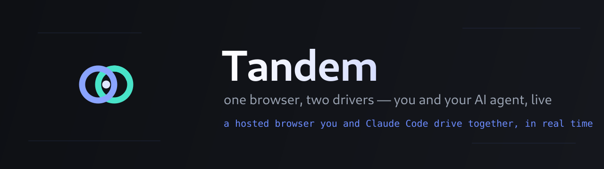
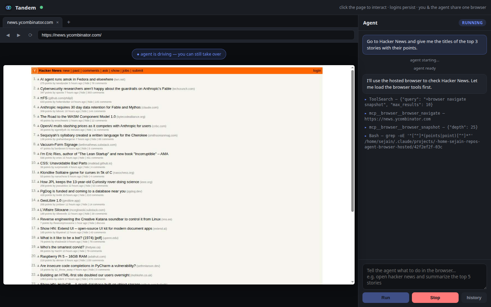
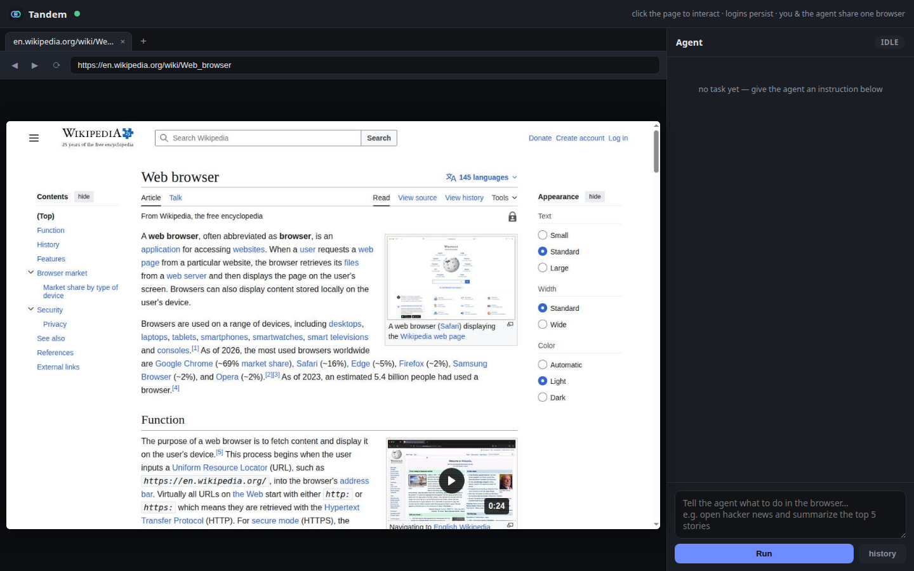
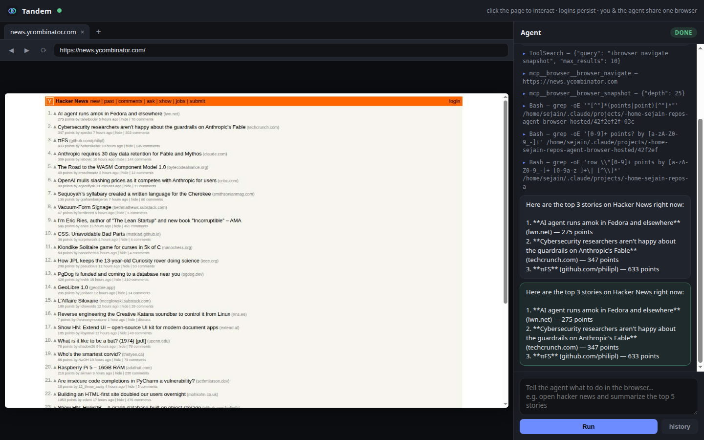
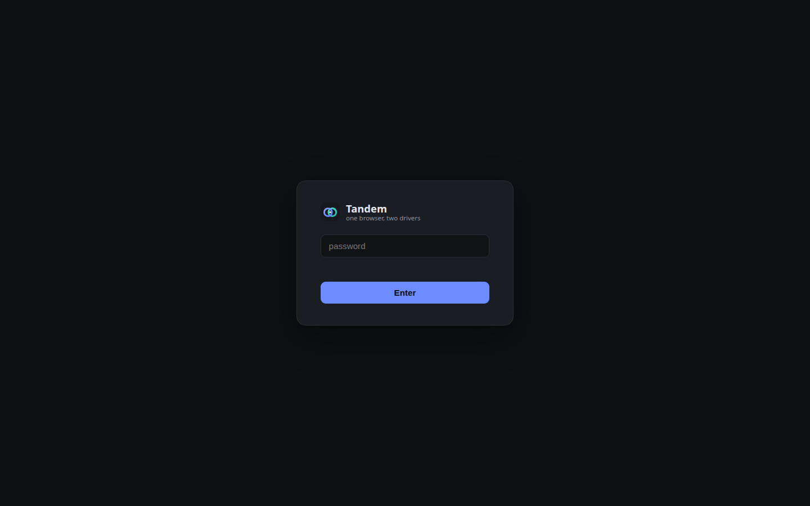

<p align="center">
  
</p>

<p align="center">
  <b>One browser, two drivers.</b><br>
  A hosted, live browser that <b>you</b> and <b>Claude Code agents</b> drive <b>together, in real time.</b>
</p>

<p align="center">
  
  
  
  
</p>

---

## What is Tandem?

Tandem runs a real Chrome browser on your server and streams it, live, into a web page you can open from any device. **You** browse and log into sites by hand. Then you hand the wheel to **Claude Code agents** that drive *the same browser* — with your sessions already logged in — to do real work:

> *"apply to this job with my resume"*  ·  *"reply to my unread Slack messages"*  ·  *"book the cheapest flight to SFO next Friday"*  ·  *"summarize every open PR assigned to me"*

Because it's **one shared browser with a persistent profile**, everything you log into, the agent can use — and you watch it work, click by click, on the live canvas. Take over at any moment; you're always in the same session.

It's a **continuous chat**, not a one-shot: keep typing follow-ups in the same conversation — *"now filter to nonstop"*, *"go back and pick the cheaper one"*, *"stop"* — and the agent steers live, retaining full context and the current page. (Built on Claude Code's streaming session input.)

<p align="center">
  
  <br><i>The agent working Hacker News live — left: the real browser, right: every thought and tool-call streaming in as it happens.</i>
</p>

---

## Why it's fast ⚡

Most "remote browser" tools feel like a laggy video call. Tandem is engineered so interaction feels **immediate**:

- **Binary frame transport.** Screencast frames are shipped as raw JPEG bytes over a binary WebSocket — no base64 (which inflates payloads 33% and forces a string-decode on every frame). The browser paints them with `createImageBitmap`, the fastest path to the canvas.
- **Frame coalescing — you always see *now*.** Each viewer holds only the *latest* frame; any frame produced while a send is still in flight is **dropped, not queued**. This is the single biggest reason it never feels laggy: latency can't accumulate, because there's no backlog to fall behind on.
- **Pipelined captures.** Chrome is acked *before* a frame is decoded and broadcast, so it starts rendering the next frame while the current one ships — the capture pipeline stays full.
- **No wasted CPU on the wire.** WebSocket per-message deflate is off (JPEG is already compressed; re-compressing only adds latency), and request logging is disabled on the hot path.
- **Instant agent startup.** Playwright MCP is installed locally and launched directly — not through `npx`, which re-resolves the package over the network on every task. Agents start acting ~0.7 s sooner.

> **Honest note on frame rate:** during *continuous full-page scrolling*, the rate is bounded by how fast Chrome can rasterize — and on a box with no usable GPU it rasterizes in software (~12–15 fps). That ceiling is physics, not the transport. **Discrete actions — clicks, typing, navigation, and the agent's work — need only a few frames and feel instant.** With a working GPU, motion frame rate climbs with zero code changes.

## Why it's reliable 🛡️

Long-running browser automation breaks in a dozen boring ways. Tandem handles them so it stays up:

- **Self-healing Chrome.** A watchdog relaunches Chrome if it ever dies and the live view reconnects automatically — your logins survive in the persistent profile.
- **Resilient CDP layer.** Page-level DevTools sockets survive cross-process navigations; dropped navigations are detected and retried; a stalled screencast re-arms itself within seconds.
- **Survives unclean restarts.** Stale virtual-display locks and orphaned browsers are detected and cleared on startup; `run.sh` refuses to start a second instance on a busy port instead of fighting over the browser.
- **Graceful tasks.** Exactly one agent task runs at a time; **Stop** terminates it cleanly with no orphans; crashes and timeouts are recorded as failures rather than hanging forever. Full task history is persisted.

## Why it isn't flagged as a bot 🥷

Headless Chrome is trivially fingerprinted — its User-Agent literally contains `HeadlessChrome` and it exposes no real WebGL context, so sites throw CAPTCHAs and "are you a bot?" walls. Tandem runs Chrome **headful inside an auto-started virtual display (Xvfb)** by default, which yields a clean `Chrome/<version>` User-Agent and a real WebGL renderer. To sites, it looks like an ordinary browser — because it is one.

---

## Screenshots

| Browse anything, logged in | Agent reports back |
|---|---|
|  |  |

| Password-gated, reachable from anywhere |
|---|
|  |

---

## How it works

```
   any device                    your server
┌───────────────┐        ┌──────────────────────────────────────────────┐
│  web UI        │  WSS   │  Tandem (FastAPI, one process)               │
│  ┌──────────┐  │◄──────►│   /ws/screen  binary JPEG out · input in     │
│  │ <canvas> │  │  binary│   /ws/agent   live task event feed           │
│  │  live    │  │ frames │   /api/tasks  start · stop · history          │
│  └──────────┘  │        │        │                  │                   │
│  agent panel   │        │        ▼                  ▼                   │
└───────────────┘        │   Chrome (headful, Xvfb)   claude -p           │
   you watch & type      │   CDP :9222 ◄──────────────┘  (per task)       │
                         │      ▲         Playwright MCP ─┘                │
                         │      └── one shared browser, persistent profile │
                         └──────────────────────────────────────────────┘
```

- The **live view** is a Chrome DevTools Protocol screencast drawn to a `<canvas>`; your mouse and keyboard are forwarded back over CDP.
- Each **agent task** spawns `claude -p` in headless mode. It gets browser tools from **[Playwright MCP](https://github.com/microsoft/playwright-mcp)** pointed at the *same* Chrome over CDP — so the agent sees your logged-in sessions and you watch it work.
- The agent's behavior lives in a plain markdown file, **`.claude/agents/browser-operator.md`** — edit it, or add more agents, with no code changes.

---

## Quickstart

**Requirements:** Python 3.10+, Node.js (for Playwright MCP), the [`claude`](https://docs.anthropic.com/en/docs/claude-code) CLI (logged in), `Xvfb` (`apt install xvfb`), and **Chrome/Chromium ≥ 149**.

```bash
git clone https://github.com/jainsee24/tandem.git
cd tandem
cp .env.example .env          # then set a strong PASSWORD
./run.sh                      # installs deps, starts on 0.0.0.0:8080
```

Open `http://<your-host>:8080`, log in, and start browsing. Type an instruction in the right-hand panel, hit **Run**, and watch the agent take the wheel.

### Reach it from anywhere

Tandem binds `0.0.0.0` and the password is the only gate, so prefer a tunnel over opening a raw port:

```bash
cloudflared tunnel --url http://localhost:8080      # free, gives an https URL
# or:  ngrok http 8080
```

> ⚠️ The hosted browser holds your **real logged-in sessions**, and agents run with `--dangerously-skip-permissions`. Use a strong password, keep it behind a tunnel or VPN, and **never** expose the raw CDP port `9222` (it has no auth — it binds localhost; keep it that way).

---

## Configuration (`.env`)

| Variable | Default | Meaning |
|---|---|---|
| `PASSWORD` | `change-me` | The only gate to your sessions — **set something strong.** |
| `PORT` | `8080` | HTTP port. |
| `HEADLESS` | `0` | `0` = headful under Xvfb (anti-bot, recommended). `1` = headless (faster, but sites flag it). |
| `XVFB_DISPLAY` | `:99` | Virtual display used in headful mode when no real `$DISPLAY`. |
| `SCREENCAST_QUALITY` | `60` | JPEG quality 1–100. Lower = smaller frames for slow tunnels. |
| `TASK_TIMEOUT_MIN` | `30` | Hard cap per agent task. |
| `CHROME_BIN` | `/snap/bin/chromium` | Browser binary (must be ≥ 149). |

---

## Defining agents

Agents are just markdown. The default operator is at `.claude/agents/browser-operator.md`:

```markdown
---
name: browser-operator
description: Drives the shared hosted Chrome to complete web tasks.
---

Snapshot the page before acting. Fill forms field by field and verify each value.
Never log out or change account settings. Stop and report if you hit a CAPTCHA,
2FA prompt, or need a credential you weren't given — don't guess personal info.
```

Edit it to change behavior, or drop in more `.claude/agents/*.md` files for specialized agents. No code changes, no restart of your edits needed.

---

## Project layout

```
server/app.py     FastAPI wiring: auth, websockets, task API
server/chrome.py  Chrome + Xvfb lifecycle (launch flags, watchdog, anti-bot)
server/cdp.py     CDP client: binary screencast, input injection, tab management
server/agent.py   claude -p runner: stream-json parsing, task history
server/auth.py    password + signed-cookie session
static/           single-page UI (vanilla JS, no build step)
.claude/agents/   editable agent definitions
```

---

## Acknowledgements

Built on top of [**Claude Code**](https://docs.anthropic.com/en/docs/claude-code) and [**Playwright MCP**](https://github.com/microsoft/playwright-mcp). Inspired by the [browser-use](https://github.com/browser-use/browser-use) project's vision of agents that use the web like people do.

## License

MIT — see [LICENSE](LICENSE).
